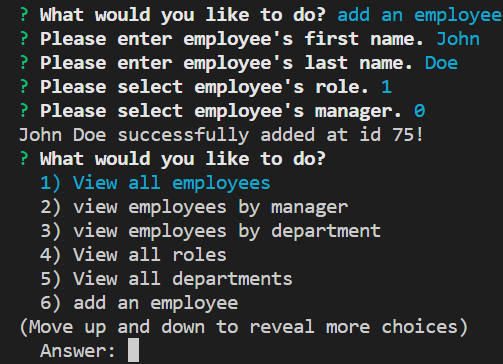

  
  
# Employee Tracker

## Description

This application runs in the CLI (Command Line Interface) using node. The application prompts the user for information regarding employees and their respective roles and departments and updates the database accordingly.

**Table of Contents**

  * [Installation](#installation)
  * [Usage](#usage)
  * [Contributing](#contributing)
  * [License](#license)
  * [Questions](#questions)

## Installation

To install the application please follow the proceeding directions: 

 1. install node 
    - go to [nodejs.org](#https://nodejs.org/)
    - install LTS version
 2. clone repo 
    - clone the repository onto your local desktop with the command 

        `git clone https://github.com/RochelleYounger/employee-tracker.git`
 3. install all dependencies
    - run the command `npm install` to install all dependencies

## Usage

 - run application in terminal with `node index.js`

    
 - select one of the many possible actions
 
    
 - fill out information when necessary

    

    
    
    
 - select quit option to exit application
    
    

## Demo

https://user-images.githubusercontent.com/54952993/155785293-c51dd592-68de-475d-81a6-a150fedd2c96.mp4

## Contributing

All contributions are subject to review.

## License
  
  This application is licensed under [ISC](https://opensource.org/licenses/ISC).

## Credits

  Code adapted from [angelinama](https://github.com/angelinama/employee-tracker)

## Questions

Github: [RochelleYounger](https://github.com/RochelleYounger)

Contact Me: [regnuoy321@gmail.com](mailto:regnuoy321@gmail.com)

---
© 2022 RochelleYounger